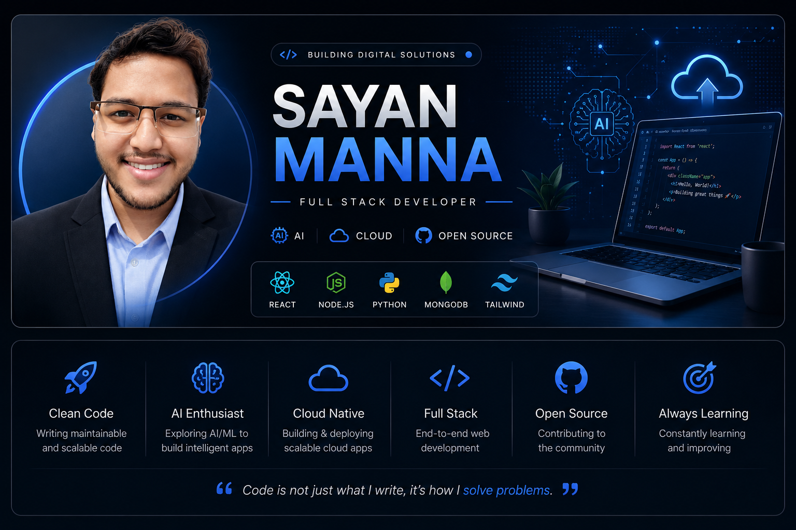

<!-- Typing animation -->

<h1 align="center">
Hi 👋, I'm Sayan Manna
</h1>

<h3 align="center">
Full Stack Developer • AI Explorer • Cloud Enthusiast
</h3>

🎓 BCA Student &nbsp;•&nbsp;
💻 Open Source Learner &nbsp;•&nbsp;
🚀 Building Scalable Web Apps

---

## 👨‍💻 About Me

🎓 **BCA Student** at **Bhawanipur Global Campus, Kolkata**

💻 Passionate about building **modern, scalable and user-centric web applications**

🚀 Currently focusing on:

- ⚛️ Full Stack Development (MERN)
- 🤖 Artificial Intelligence & Machine Learning
- ☁️ Cloud Computing
- 📊 Data Structures & Algorithms
- 🎨 Modern UI/UX Engineering

🌱 **Currently Learning**

- Advanced React
- Node.js & Express
- Backend Architecture
- AI Integration
- System Design

🎯 **2026 Goals**

- ✅ Build production-ready full-stack applications
- ✅ Contribute to Open Source
- ✅ Master MERN Stack
- ✅ Learn Cloud Technologies
- ✅ Land a Software Engineering Internship

📫 **Email:** **sayanmanna.in@gmail.com**

 

---
## 🛠️ Tech Stack

### 💻 Frontend

### ⚙️ Backend

### 🗄️ Database

### 🤖 Programming Languages

### ☁️ Tools & Technologies

---
## 🚀 Featured Projects

<table>
<tr>

<td width="50%">

### 🌐 Portfolio Website

Modern developer portfolio with responsive UI, animations and premium design.

**Tech Stack**

`React` `Tailwind CSS` `JavaScript`

🔗 **Live Demo:** https://portfolio-website-v1-alpha.vercel.app/

📂 **Source:** https://github.com/iamsayanmanna

</td>

<td width="50%">

### ☕ Royal Coffee

Luxury coffee website inspired by Apple-style design.

**Tech Stack**

`React` `Tailwind CSS`

📂 **Source:** https://github.com/iamsayanmanna

</td>

</tr>

<tr>

<td width="50%">

### 🤖 AI Chatbot

Interactive chatbot with modern UI and contextual conversations.

**Tech Stack**

`JavaScript` `Bootstrap`

📂 **Source:** https://github.com/iamsayanmanna

</td>

<td width="50%">

### 🌦️ AI Weather App

Weather dashboard with AQI, sunrise/sunset and responsive interface.

**Tech Stack**

`HTML` `CSS` `JavaScript`

📂 **Source:** https://github.com/iamsayanmanna

</td>

</tr>

</table>

---

## 📊 GitHub Dashboard

  

---

## ⚡ Current GitHub Activity

<!--START_SECTION:activity-->
<!--END_SECTION:activity-->

---

## 📈 Contribution Graph

---

## 🏆 GitHub Achievements

---

## 📬 Connect With Me

---

<h3 align="center">
✨ Thanks for visiting my profile! Let's build something amazing together. 🚀
</h3>

